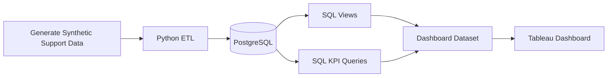
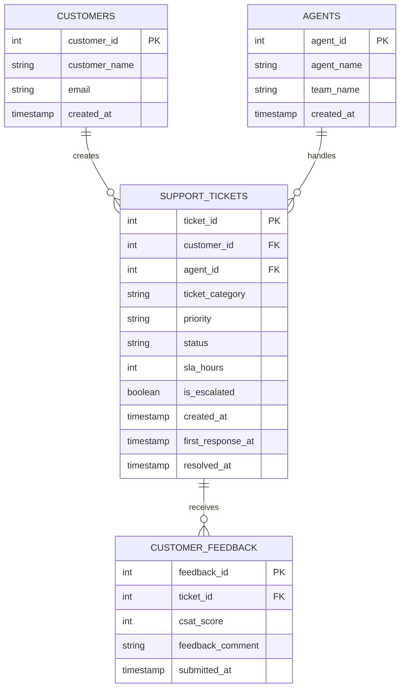
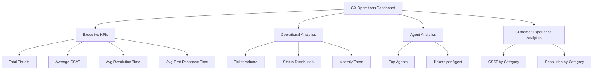
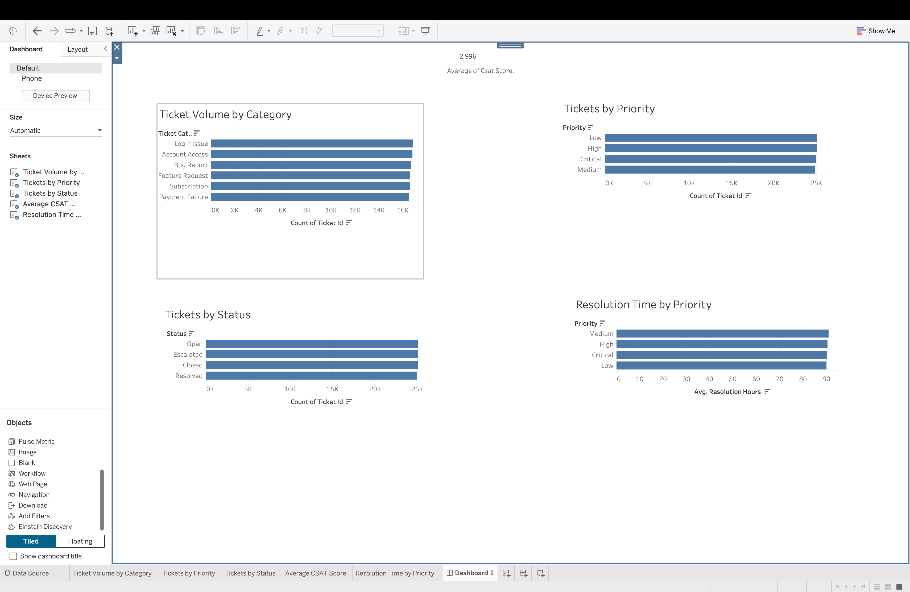

# 📊 CX Operations Analytics

<div align="center">

### End-to-End Customer Experience & Support Operations Analytics

A portfolio-grade analytics pipeline that simulates customer support operations, transforms operational data with Python, analyzes CX KPIs with SQL, and prepares a dashboard-ready dataset for BI reporting.

<br/>


</div>

---

## Table of Contents

- [Overview](#-overview)
- [Business Problem](#-business-problem)
- [What This Project Demonstrates](#-what-this-project-demonstrates)
- [End-to-End Architecture](#-end-to-end-architecture)
- [Data Model](#-data-model)
- [Analytics Covered](#-analytics-covered)
- [SQL KPI Layer](#-sql-kpi-layer)
- [Operational Metrics](#-operational-metrics)
- [Dataset Scale](#-dataset-scale)
- [Tech Stack](#-tech-stack)
- [Repository Structure](#-repository-structure)
- [Getting Started](#-getting-started)
- [Python Environment](#-python-environment)
- [Data Pipeline](#-data-pipeline)
- [Database Initialization](#-database-initialization)
- [Dashboard](#-dashboard)
- [Dashboard Preview](#-dashboard-preview)
- [Analytical Questions](#-analytical-questions)
- [Data & Privacy](#-data--privacy)
- [Current Status](#-current-status)
- [Roadmap](#-roadmap)
- [Development Workflow](#-development-workflow)
- [Contributing](#-contributing)
- [Documentation](#-documentation)
- [Author](#-author)
- [License](#-license)

---

## 📌 Overview

**CX Operations Analytics** is an end-to-end Customer Experience analytics project built around a simulated customer support environment.

The project demonstrates how operational support data can move through a practical analytics workflow:

```text
Synthetic Data
     ↓
Python ETL
     ↓
PostgreSQL
     ↓
SQL Views & KPI Queries
     ↓
Dashboard Dataset
     ↓
BI Visualization
```

The focus is not simply on creating charts. The project models the underlying support operation, structures the data relationally, calculates operational KPIs, and produces a dataset designed for decision-oriented CX reporting.

---

## 🎯 Business Problem

Customer support teams generate large volumes of operational data across tickets, agents, customers, priorities, response times, resolution times, and customer feedback.

Without a structured analytics layer, it becomes difficult to answer questions such as:

- How many support tickets are being generated?
- Which categories generate the most demand?
- How quickly are customers receiving their first response?
- How long does ticket resolution take?
- Which priorities consume the most operational time?
- How is workload distributed across agents?
- Where does customer satisfaction vary?
- How is support demand changing over time?

This project turns those operational questions into measurable KPIs.

---

## 💡 What This Project Demonstrates

<details>
<summary><strong>🔄 Data Engineering</strong></summary>

- Synthetic operational data generation
- Raw and processed data separation
- Python-based ETL workflow
- PostgreSQL loading
- Relational schema design
- Database-backed analytics

</details>

<details>
<summary><strong>🧮 SQL Analytics</strong></summary>

- Aggregations
- Joins
- Grouping and sorting
- Date-based trend analysis
- Percentage calculations
- Derived operational metrics
- Reusable SQL views

</details>

<details>
<summary><strong>📈 Customer Experience Analytics</strong></summary>

- Ticket volume
- Ticket status distribution
- Customer satisfaction (CSAT)
- First response time
- Resolution time
- Agent productivity
- Category-level analysis
- Priority-level analysis
- Monthly support trends

</details>

<details>
<summary><strong>📊 Business Intelligence</strong></summary>

- Executive KPI design
- Operational dashboard structure
- Interactive filtering
- Agent analytics
- Customer experience reporting
- Dashboard-ready dataset creation

</details>

---

## 🧩 End-to-End Architecture



### Pipeline Breakdown

| Stage | Responsibility |
|---|---|
| Data Generation | Creates simulated customers, agents, support tickets, and customer feedback |
| ETL | Processes and loads operational datasets |
| PostgreSQL | Stores structured relational data |
| SQL Views | Creates reusable response and resolution metrics |
| KPI Queries | Calculates business-facing support metrics |
| Dashboard Dataset | Combines operational fields and derived metrics for BI |
| Tableau | Presents the analytical output |

---

## 🗄️ Data Model

The database models four core entities:



---

## 📊 Analytics Covered

### Executive KPIs

- **Total Tickets**
- **Average CSAT**
- **Average Resolution Time**
- **Average First Response Time**

### Operational Analytics

- Ticket Volume by Category
- Ticket Status Distribution
- Monthly Ticket Trend
- Open vs Closed Ticket Rate

### Agent Analytics

- Top 10 Agents by Tickets Handled
- Tickets Handled per Agent
- Team-level agent context

### Customer Experience Analytics

- CSAT by Ticket Category
- Resolution Time by Category
- Resolution Time by Priority
- First Response Time by Priority

---

## 🧮 SQL KPI Layer

The project contains a dedicated KPI query layer in:

`sql/004_kpi_queries.sql`

It currently contains **10 analytical queries**.

| KPI | Analytical Purpose |
|---|---|
| Ticket Volume by Category | Understand support demand distribution |
| Ticket Status Distribution | Monitor ticket lifecycle |
| Top 10 Agents | Measure ticket handling volume |
| Average CSAT by Category | Analyze customer satisfaction across categories |
| Monthly Ticket Trend | Identify demand over time |
| Resolution Time by Priority | Analyze operational effort by urgency |
| First Response Time by Priority | Measure responsiveness |
| Tickets per Agent | Understand workload distribution |
| Open vs Closed Rate | Monitor ticket-state composition |
| Resolution Time by Category | Identify category-level resolution patterns |

---

## ⏱️ Operational Metrics

The SQL layer derives time-based CX metrics directly from ticket timestamps.

### First Response Time

```text
first_response_hours =
(first_response_at - created_at) / 3600
```

### Resolution Time

```text
resolution_hours =
(resolved_at - created_at) / 3600
```

These metrics are exposed through the reusable SQL view:

`sql/003_views.sql`

---

## 📦 Dataset Scale

The simulated analytical environment is designed around:

| Entity | Volume |
|---|---:|
| Customers | 5,000 |
| Support Agents | 50 |
| Support Tickets | 100,000 |
| Customer Feedback Records | 40,000 |
| **Total Records** | **145,000+** |

> Generated CSV files are excluded from version control through `.gitignore`.

---

## 🛠️ Tech Stack

### Data Layer

- PostgreSQL 16
- SQL

### ETL & Processing

- Python
- Pandas
- SQLAlchemy

### Infrastructure

- Docker
- Docker Compose

### Business Intelligence

- Tableau

### Development

- Git
- GitHub

---

## 📁 Repository Structure

```text
cx-operations-analytics/
│
├── api/
│   └── .gitkeep
│
├── data/
│   ├── raw/
│   │   └── .gitkeep
│   ├── processed/
│   │   └── .gitkeep
│   └── .gitkeep
│
├── docs/
│   ├── dashboard_design.md
│   ├── results/
│   │   └── kpi_results.txt
│   └── screenshots/
│       └── dashboard-overview.png
│
├── etl/
│   ├── scripts/
│   │   ├── generate_data.py
│   │   └── load_data.py
│   └── .gitkeep
│
├── powerbi/
│   └── .gitkeep
│
├── sql/
│   ├── 001_schema.sql
│   ├── 002_seed.sql
│   ├── 003_views.sql
│   ├── 004_kpi_queries.sql
│   ├── 005_dashboard_dataset.sql
│   └── .gitkeep
│
├── docker-compose.yml
├── .gitignore
└── README.md
```

---

## 🚀 Getting Started

### 1. Clone the Repository

```bash
git clone https://github.com/absksync/cx-operations-analytics.git
cd cx-operations-analytics
```

### 2. Start PostgreSQL

The repository includes a Docker Compose configuration for PostgreSQL 16.

```bash
docker compose up -d
```

The configured database is:

```text
Database:  cx_analytics
User:      cx_admin
Port:      5432
Container: cx-postgres
```

### 3. Verify the Container

```bash
docker ps
```

---

## 🐍 Python Environment

Create a virtual environment:

```bash
python -m venv .venv
```

Activate it on macOS/Linux:

```bash
source .venv/bin/activate
```

Install the required packages:

```bash
pip install pandas sqlalchemy psycopg2-binary
```

---

## ⚙️ Data Pipeline

The ETL layer currently contains two primary scripts.

### Generate Data

`etl/scripts/generate_data.py`

Generates the simulated customer support datasets.

### Load Data

`etl/scripts/load_data.py`

Loads generated datasets into PostgreSQL.

A typical workflow is:

```bash
python etl/scripts/generate_data.py
python etl/scripts/load_data.py
```

> Run the scripts from the repository root so their relative paths resolve correctly.

---

## 🗃️ Database Initialization

Run the SQL files in order.

### 1. Schema

`sql/001_schema.sql`

Creates:

- `customers`
- `agents`
- `support_tickets`
- `customer_feedback`

### 2. Seed Layer

`sql/002_seed.sql`

Reserved for seed data.

### 3. Reusable Metrics View

`sql/003_views.sql`

Creates:

`ticket_resolution_metrics`

### 4. KPI Queries

`sql/004_kpi_queries.sql`

Contains the analytical KPI layer.

### 5. Dashboard Dataset

`sql/005_dashboard_dataset.sql`

Produces a combined analytical dataset containing:

- Ticket information
- Agent information
- Customer information
- CSAT
- First response hours
- Resolution hours

---

## 📊 Dashboard

The dashboard design is documented in:

`docs/dashboard_design.md`

### Dashboard Sections



### Dashboard Filters

The dashboard design includes:

- Ticket Category
- Priority
- Status
- Month

---

## 🖼️ Dashboard Preview



---

## 🔍 Analytical Questions

This project is designed to answer operational questions such as:

<details>
<summary><strong>Which support categories generate the most demand?</strong></summary>

Use ticket volume by category to identify where operational workload is concentrated.

</details>

<details>
<summary><strong>Which priorities require the most resolution time?</strong></summary>

Compare average resolution hours by priority.

</details>

<details>
<summary><strong>How quickly are customers receiving an initial response?</strong></summary>

Analyze average first response hours by priority and over time.

</details>

<details>
<summary><strong>Where does customer satisfaction vary?</strong></summary>

Compare average CSAT across ticket categories.

</details>

<details>
<summary><strong>How is support workload distributed?</strong></summary>

Compare tickets handled across individual agents.

</details>

---

## 🔐 Data & Privacy

This project uses **synthetic customer support data** for analytics and development purposes.

No real customer information is required to reproduce the analytical workflow.

Generated CSV files are excluded from version control through the repository's `.gitignore`.

---

## ✅ Current Status

| Area | Status |
|---|---|
| Repository structure | ✅ |
| PostgreSQL container | ✅ |
| Relational schema | ✅ |
| Synthetic data generation | ✅ |
| Data loading scripts | ✅ |
| SQL metric view | ✅ |
| KPI query layer | ✅ |
| Dashboard dataset query | ✅ |
| Dashboard design documentation | ✅ |
| Dashboard screenshot | ✅ |
| API layer | 🧩 Placeholder |
| Power BI directory | 🧩 Placeholder |

---

## 🗺️ Roadmap

### Phase 1 — Analytics Foundation

- [x] PostgreSQL setup
- [x] Relational schema
- [x] Synthetic data generation
- [x] ETL scripts
- [x] SQL KPI layer
- [x] Dashboard dataset

### Phase 2 — BI Expansion

- [ ] Add finalized BI workbook artifacts
- [ ] Expand dashboard interactions
- [ ] Add SLA compliance metrics
- [ ] Add escalation-rate analysis
- [ ] Add team-level performance analysis

### Phase 3 — CX Intelligence

- [ ] Trend anomaly detection
- [ ] Deeper customer segmentation
- [ ] Cohort-style support analysis
- [ ] Root-cause exploration
- [ ] Automated reporting

### Phase 4 — Application Layer

- [ ] Analytics API
- [ ] Programmatic KPI access
- [ ] Dashboard application
- [ ] Automated pipeline execution

---

## 🧪 Development Workflow

The repository follows a feature-oriented Git workflow.

```text
main
  │
develop
  │
feature/*
```

Example:

```bash
git checkout develop
git checkout -b feature/new-kpi
```

Commit with a focused message:

```bash
git add .
git commit -m "feat: add SLA compliance KPI"
```

Push the feature:

```bash
git push origin feature/new-kpi
```

Then open a pull request:

```text
feature/* → develop
develop   → main
```

---

## 🤝 Contributing

Contributions and improvements are welcome.

Before opening a pull request:

1. Create a feature branch.
2. Keep changes focused.
3. Test SQL and ETL changes locally.
4. Update documentation when behavior changes.
5. Open a pull request against `develop`.

---

## 📚 Documentation

Project documentation lives under:

```text
docs/
├── dashboard_design.md
├── results/
└── screenshots/
```

The SQL layer is organized sequentially under:

```text
sql/
├── schema
├── seed
├── views
├── KPI queries
└── dashboard dataset
```

---

## 👨‍💻 Author

<div align="center">

**Abhishek Singh**

Built as a practical Customer Experience / Operations Analytics portfolio project.

[GitHub](https://github.com/absksync)

</div>

---

## 📄 License

This project is licensed under the **MIT License**.

See the repository for the applicable license terms.

---

<div align="center">

### Turning support operations data into actionable CX insights.

⭐ Star the repository if you find the project useful.

</div>
