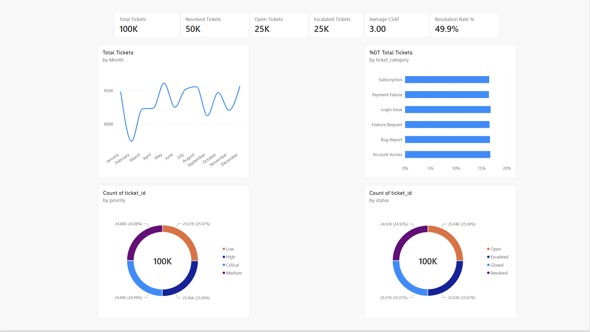
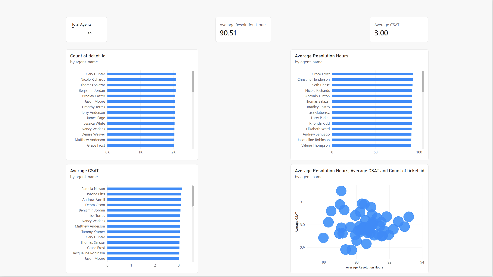
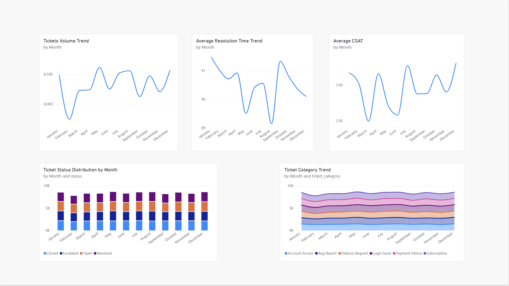
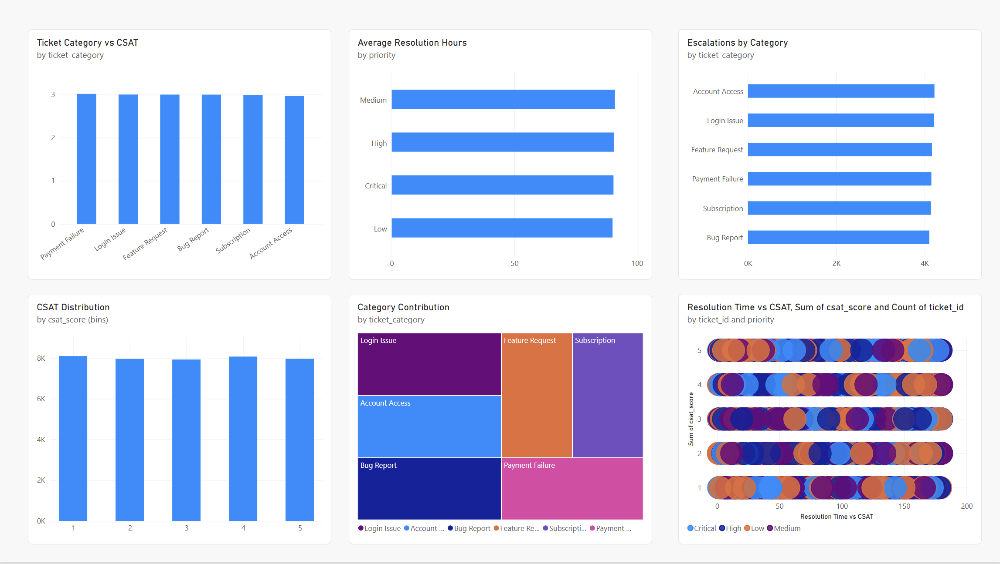

# 📊 CX Operations Analytics

<div align="center">

## Customer Experience Analytics & Business Intelligence Platform

**Python • PostgreSQL • SQL • Power BI • Docker**

An end-to-end analytics project that transforms customer support operations data into actionable business intelligence across ticket volume, service performance, customer satisfaction, escalations, and agent workload.


</div>
---

# 📄 Additional Documentation

The project includes supporting documentation that explains the analytical approach, dataset structure, SQL implementation, and business findings.

| Document | Description |
|-----------|-------------|
| [Business Insights](docs/business_insights.md) | Key findings, recommendations, and business impact analysis |
| [Data Dictionary](docs/data_dictionary.md) | Dataset schema, column definitions, and entity descriptions |
| [ER Diagram](docs/er_diagram.md) | Customer support data model and entity relationships |
| [SQL Analytics Showcase](docs/sql_analytics_showcase.md) | Advanced SQL queries, KPI calculations, and analytical examples |
| [Dashboard Design](docs/dashboard_design.md) | Dashboard planning, KPI selection, and reporting design decisions |

---

---

## 📌 Project at a Glance

| Area | Details |
|---|---|
| **Domain** | Customer Experience / Support Operations |
| **Tickets** | 100,000 |
| **Customers** | 5,000 |
| **Support Agents** | 50 |
| **Customer Feedback** | 40,000 records |
| **Total Records** | 145,000+ |
| **ETL** | Python + Pandas |
| **Database** | PostgreSQL |
| **Analytics** | SQL |
| **BI** | Power BI |
| **Infrastructure** | Docker |

---

## 🎯 Business Problem

Customer support organizations generate large volumes of operational data, but raw ticket records do not automatically provide the visibility needed for effective decision-making.

This project simulates a SaaS customer support environment and builds an analytics workflow to answer questions such as:

- How much support demand is being generated?
- Which ticket categories contribute most to overall volume?
- How are tickets distributed by priority and status?
- How quickly are tickets being resolved?
- Which categories generate the most escalations?
- How is workload distributed across support agents?
- How does customer satisfaction vary across categories and time?
- What patterns exist between resolution time and CSAT?

The objective is to move from:

**Raw Support Data → Structured KPIs → Business Intelligence**

---

## 🏗️ End-to-End Architecture

```text
Synthetic / Raw Support Data
            │
            ▼
     Python + Pandas ETL
            │
            ▼
       PostgreSQL
            │
            ▼
     SQL Analytics Layer
            │
      ┌─────┴─────┐
      ▼           ▼
   KPI Views   KPI Queries
      │           │
      └─────┬─────┘
            ▼
      Power BI Dataset
            │
            ▼
    Interactive Dashboards
```

### Pipeline Responsibilities

| Layer | Responsibility |
|---|---|
| **Python / Pandas** | Data generation, cleaning, transformation, and loading |
| **PostgreSQL** | Relational data storage |
| **SQL** | KPI calculations, aggregations, views, and analytics |
| **Power BI** | Interactive dashboards and business reporting |
| **Docker** | Reproducible local database environment |

---

# 📊 Power BI Dashboard Suite

The reporting layer is organized into four focused dashboards covering executive monitoring, workforce performance, operational trends, and customer experience.

---

## 1️⃣ Executive Overview



### Core KPIs

- Total Tickets
- Resolved Tickets
- Open Tickets
- Escalated Tickets
- Average CSAT
- Resolution Rate

### Analysis Included

- Ticket Volume by Month
- Ticket Category Distribution
- Priority Distribution
- Ticket Status Distribution

### Business Question

**What is the overall health of customer support operations?**

This page provides a high-level operational view for monitoring support demand, service status, and customer experience KPIs.

---

## 2️⃣ Agent Performance



### Core KPIs

- Tickets Handled per Agent
- Average Resolution Hours
- Average CSAT

### Analysis Included

- Agent Workload Distribution
- Average Resolution Time by Agent
- Average CSAT by Agent
- Resolution Time vs CSAT

### Business Question

**How does workload and service performance vary across support agents?**

This page provides agent-level operational context for workforce and service-performance analysis.

---

## 3️⃣ Time Trends



### Core KPIs

- Monthly Ticket Volume
- Average Resolution Time
- Average CSAT

### Analysis Included

- Ticket Volume Trend
- Resolution Time Trend
- CSAT Trend
- Ticket Status Distribution by Month
- Ticket Category Trend by Month

### Business Question

**How are customer support operations changing over time?**

This dashboard adds temporal context to demand, service performance, ticket status, and category trends.

---

## 4️⃣ Customer Insights



### Core KPIs

- CSAT by Category
- Resolution Time by Priority
- Escalations by Category
- CSAT Distribution

### Analysis Included

- Ticket Category vs CSAT
- Escalations by Category
- Category Contribution
- Resolution Time vs CSAT

### Business Question

**What patterns in support operations are associated with customer experience?**

This dashboard connects customer satisfaction with ticket categories, escalations, and resolution-time analysis.

---

# 📈 Core CX & Support KPIs

### Ticket Volume

Measures the number of support tickets generated over a selected period or segment.

### Resolution Rate

```text
Resolved Tickets / Total Tickets
```

### Escalation Rate

```text
Escalated Tickets / Total Tickets
```

### Average Resolution Time

```text
AVG(resolution_hours)
```

### Average CSAT

```text
AVG(csat_score)
```

### First Response Time

```text
first_response_at - created_at
```

---

# 🔍 Analytics Coverage

## Operations Analytics

- Ticket Volume
- Ticket Status
- Priority Distribution
- Category Distribution
- Resolution Rate
- Escalation Rate

## Customer Experience Analytics

- CSAT
- CSAT by Category
- CSAT Trends
- CSAT Distribution
- Resolution Time vs CSAT

## Workforce Analytics

- Tickets per Agent
- Agent Workload
- Average Resolution Time by Agent
- Average CSAT by Agent

## Trend Analytics

- Monthly Ticket Volume
- Monthly Resolution Time
- Monthly CSAT
- Status Trends
- Category Trends

---

# 🧮 SQL Analytics Layer

The SQL layer provides reusable analytical logic for business reporting.

Key analysis areas include:

- Ticket Volume by Category
- Ticket Status Distribution
- Ticket Volume by Priority
- Monthly Ticket Trends
- Resolution Time by Priority
- Resolution Time by Category
- First Response Time by Priority
- Tickets per Agent
- Agent-Level CSAT
- Category-Level CSAT
- Escalation Analysis
- Resolution Rate

---

# 🗄️ Data Model

The project represents a customer support environment through relationships between customers, support agents, tickets, and customer feedback.

```text
Customers
    │
    └──────────────┐
                   ▼
              Support Tickets
              │            │
              │            └──────────────► Agents
              │
              └───────────────────────────► Customer Feedback
```

### Main Entities

| Entity | Purpose |
|---|---|
| **Customers** | Customer-level information |
| **Agents** | Support workforce information |
| **Support Tickets** | Core operational events |
| **Customer Feedback** | Customer satisfaction data |

---

# 📦 Dataset Scale

| Entity | Records |
|---|---:|
| Customers | 5,000 |
| Support Agents | 50 |
| Support Tickets | 100,000 |
| Customer Feedback | 40,000 |
| **Total** | **145,000+** |

> The dataset is synthetic and intended for analytics, demonstration, and portfolio use.

---

# 🛠️ Technology Stack

| Layer | Technology |
|---|---|
| Programming | Python |
| Data Processing | Pandas |
| Database | PostgreSQL |
| Querying | SQL |
| Data Access | SQLAlchemy |
| Business Intelligence | Power BI |
| Infrastructure | Docker / Docker Compose |
| Version Control | Git / GitHub |

---

# 📁 Repository Structure

```text
cx-operations-analytics/
│
├── api/
│
├── data/
│   ├── raw/
│   └── processed/
│
├── docs/
│   ├── results/
│   │   └── kpi_results.txt
│   ├── dashboard_design.md
│   └── screenshots/
│       ├── powerbi-executive-overview.png
│       ├── powerbi-agent-performance.png
│       ├── powerbi-time-trends.png
│       └── powerbi-customer-insights.png
│
├── etl/
│   └── scripts/
│
├── powerbi/
│
├── sql/
│   ├── 001_schema.sql
│   ├── 002_seed.sql
│   ├── 003_views.sql
│   ├── 004_kpi_queries.sql
│   └── 005_dashboard_dataset.sql
│
├── docker-compose.yml
└── README.md
```

---

# ⚙️ Running the Project

## 1. Clone the Repository

```bash
git clone https://github.com/absksync/cx-operations-analytics.git
cd cx-operations-analytics
```

## 2. Start PostgreSQL

```bash
docker compose up -d
```

## 3. Create a Virtual Environment

```bash
python -m venv .venv
source .venv/bin/activate
```

## 4. Install Dependencies

```bash
pip install pandas sqlalchemy psycopg2-binary
```

## 5. Generate and Load Data

```bash
python etl/scripts/generate_data.py
python etl/scripts/load_data.py
```

## 6. Execute the SQL Layer

Run the SQL scripts in order:

```text
sql/001_schema.sql
sql/002_seed.sql
sql/003_views.sql
sql/004_kpi_queries.sql
sql/005_dashboard_dataset.sql
```

## 7. Power BI

Connect Power BI to the prepared analytical dataset and use the report for interactive exploration.

---

# 🎤 Interview Talking Points

### Data Engineering

**How did you move the operational data into the analytics environment?**

The workflow uses Python and Pandas for data generation, transformation, and loading into PostgreSQL.

### SQL Analytics

**Why separate SQL analytics from visualization?**

The SQL layer centralizes reusable KPI logic and analytical transformations so reporting is based on structured metrics rather than ad-hoc calculations.

### Business Intelligence

**Why Power BI?**

The dashboard layer converts analytical outputs into interactive visual reports for operational and customer-experience analysis.

### CX Analytics

**Which metrics are important for support operations?**

Ticket volume, first response time, resolution time, escalation rate, resolution rate, and CSAT provide complementary views of workload, responsiveness, service efficiency, and customer experience.

---

# 🎯 Resume Description

> **Built an end-to-end Customer Experience Analytics platform using Python, PostgreSQL, SQL, and Power BI. Developed ETL pipelines and analytical SQL layers for 100K support tickets, then created interactive dashboards covering ticket operations, agent workload, resolution efficiency, escalations, customer satisfaction, and monthly trends.**

---

# 🧠 Skills Demonstrated

```text
Python
Pandas
SQL
PostgreSQL
ETL
Data Cleaning
Data Transformation
Data Validation
Data Modeling
KPI Development
Customer Experience Analytics
Business Intelligence
Power BI
Dashboard Development
Trend Analysis
Agent Performance Analytics
Git
Docker
```

---

# 🔐 Data & Privacy

This project uses synthetic data only.

No production customer records, credentials, API keys, or real customer PII are required.

---

# 👨‍💻 Author

## Abhishek Singh

**Computer Science Engineering — Data Science**

### Areas of Interest

- Data Analytics
- Business Intelligence
- Customer Experience Analytics
- Product Analytics
- Data Engineering

[GitHub](https://github.com/absksync)

---

<div align="center">

### Raw Support Data → ETL → SQL → Power BI → Business Insights

</div>
