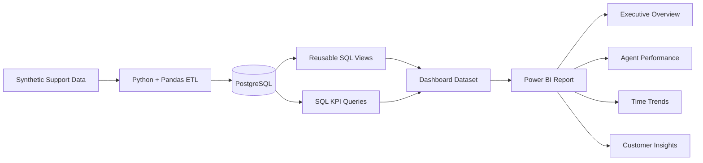
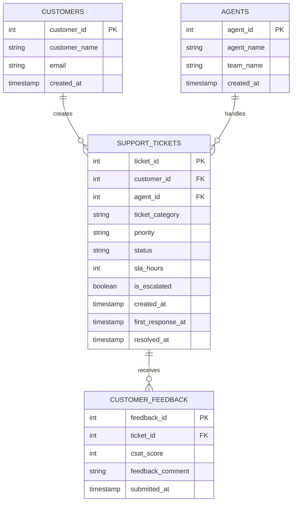

from pathlib import Path
import shutil
import zipfile

# Exact uploaded screenshot paths supplied by the environment.
uploads = [
    Path("/mnt/data/Screenshot 2026-10-02 at 6.43.46 AM.png"),
    Path("/mnt/data/Screenshot 2026-10-02 at 6.43.54 AM.png"),
    Path("/mnt/data/Screenshot 2026-10-02 at 6.44.02 AM.png"),
    Path("/mnt/data/Screenshot 2026-10-02 at 6.44.11 AM.png"),
]

stage = Path("/mnt/data/cx-operations-analytics-readme-update")
shots = stage / "docs" / "screenshots"
shots.mkdir(parents=True, exist_ok=True)

# Copy screenshots under stable, README-friendly names.
target_names = [
    "powerbi-executive-overview.png",
    "powerbi-agent-performance.png",
    "powerbi-time-trends.png",
    "powerbi-customer-insights.png",
]
for src, name in zip(uploads, target_names):
    shutil.copy2(src, shots / name)

readme = r'''# 📊 CX Operations Analytics

<div align="center">

### Customer Experience • Support Operations • Business Intelligence

**Python ETL → PostgreSQL → SQL Analytics → Power BI**

A production-style portfolio project that turns **100K synthetic support tickets** into decision-ready CX analytics across ticket demand, response time, resolution efficiency, escalations, agent workload, and customer satisfaction.

<br/>


</div>

---

## 🔎 Recruiter snapshot

| Area | What this project demonstrates |
|---|---|
| **Data scale** | 5,000 customers • 50 agents • 100,000 tickets • 40,000 feedback records |
| **ETL** | Python + Pandas |
| **Database** | PostgreSQL 16 |
| **Analytics** | SQL views + KPI query layer |
| **BI** | 4-page Power BI report |
| **CX metrics** | CSAT • first response time • resolution time • escalations |
| **Operations** | ticket volume • status • priority • category • workload |
| **Infrastructure** | Docker Compose |
| **Workflow** | Git / GitHub feature-branch development |
| **Data** | Synthetic / non-production |

---

## 🎯 Business problem

Customer-support teams generate large volumes of operational data, but raw ticket records do not automatically answer the questions leaders care about.

This project is built around questions such as:

- Where is support demand concentrated?
- Which priorities consume the most resolution time?
- How quickly are customers receiving a first response?
- Which categories generate the most escalations?
- How is workload distributed across agents?
- How does CSAT vary by category and over time?
- Which operational patterns deserve further investigation?

The result is a practical workflow that connects:

**raw operational events → reusable KPIs → interactive BI reporting**

---

## 🧠 What this project demonstrates

<details>
<summary><strong>🔄 Data Engineering</strong></summary>

- Synthetic support-data generation
- Raw / processed data separation
- Python-based ETL
- Pandas transformation
- PostgreSQL ingestion
- Reproducible local infrastructure with Docker

</details>

<details>
<summary><strong>🧮 SQL Analytics</strong></summary>

- Aggregations and grouping
- Relational joins
- Date-based analysis
- Derived time metrics
- Percentage calculations
- Reusable SQL views
- Dedicated KPI query layer

</details>

<details>
<summary><strong>📈 CX & Operations Analytics</strong></summary>

- Ticket demand
- Ticket lifecycle / status distribution
- First response time
- Resolution time
- Resolution rate
- Escalation rate
- CSAT
- Priority analysis
- Category analysis
- Agent workload

</details>

<details>
<summary><strong>📊 Power BI</strong></summary>

- Executive KPI cards
- Monthly trend analysis
- Agent performance analysis
- Customer-insight analysis
- Category and priority breakdowns
- CSAT distribution
- Resolution-time analysis
- Resolution time vs CSAT
- Interactive filtering / cross-filtering
- Drill-through-ready report structure

</details>

---

# 📊 Power BI report

The reporting layer is organized into four pages, each with a distinct business purpose.

| Page | Focus |
|---|---|
| **1. Executive Overview** | Overall support-health snapshot |
| **2. Agent Performance** | Workload and agent-level service context |
| **3. Time Trends** | Monthly demand and service-performance movement |
| **4. Customer Insights** | CSAT, escalations, categories, and resolution relationships |

### 📸 Dashboard gallery

> The images below are the current Power BI report pages.

### 1️⃣ Executive Overview


<details>
<summary><strong>What this page answers</strong></summary>

**Executive health at a glance.**

Core KPIs currently shown:

- Total Tickets — **100K**
- Resolved Tickets — **50K**
- Open Tickets — **25K**
- Escalated Tickets — **25K**
- Average CSAT — **3.00**
- Resolution Rate — **49.9%**

Supporting views cover ticket volume by month, category contribution, priority mix, and ticket status.

</details>

---

### 2️⃣ Agent Performance


<details>
<summary><strong>What this page answers</strong></summary>

**How is support workload distributed across agents, and how does service performance vary?**

The page includes:

- Tickets handled per agent
- Average resolution hours by agent
- Average CSAT by agent
- Agent-level workload distribution
- Resolution-time vs CSAT analysis

The goal is to provide operational context rather than reducing agent performance to one metric.

</details>

---

### 3️⃣ Time Trends


<details>
<summary><strong>What this page answers</strong></summary>

**How does support behavior change over time?**

The page tracks:

- Ticket volume trend
- Average resolution time trend
- Average CSAT trend
- Ticket status distribution by month
- Ticket category trend by month

This adds temporal context to otherwise static aggregate KPIs.

</details>

---

### 4️⃣ Customer Insights


<details>
<summary><strong>What this page answers</strong></summary>

**Where do customer experience and operational patterns differ?**

The page includes:

- Ticket Category vs CSAT
- Average Resolution Hours by Priority
- Escalations by Category
- CSAT Distribution
- Ticket Volume by Category
- Resolution Time vs CSAT

The scatter analysis is intended to investigate the relationship between resolution time and customer satisfaction while using priority as a segmentation dimension.

</details>

---

## 🧩 End-to-end architecture



| Layer | Responsibility |
|---|---|
| **Python** | Generate and transform operational data |
| **PostgreSQL** | Store relational support data |
| **SQL Views** | Derive reusable response / resolution metrics |
| **SQL KPI Layer** | Produce business-facing analytical queries |
| **Dashboard Dataset** | Provide BI-ready analytical fields |
| **Power BI** | Interactive reporting and visual analysis |

---

## 🗄️ Data model

The project models a support environment through four core entities:



---

## 📦 Dataset scale

| Entity | Volume |
|---|---:|
| Customers | 5,000 |
| Support Agents | 50 |
| Support Tickets | 100,000 |
| Customer Feedback | 40,000 |
| **Total records** | **145,000+** |

> All analytical records are synthetic and intended for development / portfolio use.

---

## ⏱️ Core operational metrics

```text
First Response Hours
= (first_response_at - created_at) / 3600

Resolution Hours
= (resolved_at - created_at) / 3600

Resolution Rate
= resolved tickets / total tickets

Escalation Rate
= escalated tickets / total tickets
```

These metrics are calculated in the analytical layer and exposed to Power BI.

---

## 🧮 SQL KPI layer

The dedicated KPI query layer lives in:

`sql/004_kpi_queries.sql`

| KPI / analysis | Business purpose |
|---|---|
| Ticket Volume by Category | Demand concentration |
| Ticket Status Distribution | Lifecycle monitoring |
| Top Agents | Workload visibility |
| Average CSAT by Category | CX comparison |
| Monthly Ticket Trend | Demand movement |
| Resolution Time by Priority | Operational effort |
| First Response Time by Priority | Responsiveness |
| Tickets per Agent | Workload distribution |
| Open vs Closed Rate | Ticket-state composition |
| Resolution Time by Category | Category-level service patterns |

---

## 🛠️ Tech stack

| Layer | Technology |
|---|---|
| Data generation | Python |
| Data processing | Pandas |
| Database | PostgreSQL 16 |
| Database access | SQLAlchemy |
| Infrastructure | Docker / Docker Compose |
| Analytics | SQL |
| Business Intelligence | **Power BI** |
| Version control | Git / GitHub |

---

## 📁 Repository structure

```text
cx-operations-analytics/
│
├── api/
├── data/
│   ├── raw/
│   └── processed/
│
├── docs/
│   ├── dashboard_design.md
│   ├── results/
│   │   └── kpi_results.txt
│   └── screenshots/
│       ├── powerbi-executive-overview.png
│       ├── powerbi-agent-performance.png
│       ├── powerbi-time-trends.png
│       └── powerbi-customer-insights.png
│
├── etl/
│   └── scripts/
│       ├── generate_data.py
│       └── load_data.py
│
├── powerbi/
│
├── sql/
│   ├── 001_schema.sql
│   ├── 002_seed.sql
│   ├── 003_views.sql
│   ├── 004_kpi_queries.sql
│   └── 005_dashboard_dataset.sql
│
├── docker-compose.yml
├── .gitignore
└── README.md
```

---

## 🚀 Reproduce locally

### 1. Clone

```bash
git clone https://github.com/absksync/cx-operations-analytics.git
cd cx-operations-analytics
```

### 2. Start PostgreSQL

```bash
docker compose up -d
```

### 3. Create a Python environment

```bash
python -m venv .venv
source .venv/bin/activate
```

### 4. Install dependencies

```bash
pip install pandas sqlalchemy psycopg2-binary
```

### 5. Generate and load data

```bash
python etl/scripts/generate_data.py
python etl/scripts/load_data.py
```

### 6. Execute the SQL layer

Run in order:

```text
sql/001_schema.sql
sql/002_seed.sql
sql/003_views.sql
sql/004_kpi_queries.sql
sql/005_dashboard_dataset.sql
```

### 7. Open the Power BI report

Connect Power BI to the dashboard dataset and open the local report from the `powerbi/` workspace.

---

## 💼 Interview-ready explanation

> **"I built an end-to-end CX operations analytics pipeline that starts with synthetic support data, transforms it through Python ETL, stores it in a relational PostgreSQL model, calculates reusable KPIs with SQL, and presents the results through a four-page Power BI report. I focused the reporting layer on support volume, response time, resolution efficiency, escalations, agent workload, and CSAT so the project could answer operational questions rather than just display charts."**

<details>
<summary><strong>Questions this project prepares me to discuss</strong></summary>

### Why PostgreSQL?
To separate the data-storage / relational layer from the BI layer and keep the workflow reproducible and queryable.

### Why SQL + Power BI?
SQL provides reusable data preparation and KPI logic; Power BI provides interactive visual analysis and reporting.

### First response time vs resolution time?
First response time measures the delay until an initial response. Resolution time measures the elapsed time until ticket resolution.

### What would I build next?
SLA compliance, team-level analysis, stronger drill-through navigation, anomaly detection, automated refresh, and scheduled reporting.

</details>

---

## ✅ Project status

| Area | Status |
|---|---|
| Repository foundation | ✅ |
| PostgreSQL | ✅ |
| Relational schema | ✅ |
| Synthetic data generation | ✅ |
| Python ETL | ✅ |
| SQL metric views | ✅ |
| SQL KPI layer | ✅ |
| Dashboard dataset | ✅ |
| Power BI — Executive Overview | ✅ |
| Power BI — Agent Performance | ✅ |
| Power BI — Time Trends | ✅ |
| Power BI — Customer Insights | ✅ |
| **Tableau reporting layer** | **❌ Replaced by Power BI** |
| API layer | 🧩 Future |

---

## 🧭 Focused roadmap

### Analytics depth

- [ ] SLA compliance / breach-rate analysis
- [ ] Team-level performance
- [ ] Stronger drill-through experience
- [ ] Exception / anomaly analysis
- [ ] Automated KPI reporting

### Application layer

- [ ] Analytics API
- [ ] Programmatic KPI access
- [ ] Automated pipeline execution

> The roadmap prioritizes analytical depth before adding unnecessary application features.

---

## 🧪 Git workflow

```text
main
  │
develop
  │
feature/*
```

Example:

```bash
git checkout develop
git checkout -b feature/new-kpi

git add .
git commit -m "feat: add SLA compliance KPI"

git push origin feature/new-kpi
```

Pull requests target `develop`; stable work is promoted to `main`.

---

## 🔐 Data & privacy

This project uses synthetic customer-support data only.

No production customer records, credentials, API keys, or real customer PII are required.

---

## 👨‍💻 Author

<div align="center">

**Abhishek Singh**

CSE • Data & Analytics • Customer Experience Operations

[GitHub](https://github.com/absksync)

</div>

---

<div align="center">

### Raw support events → structured analytics → decision-ready CX reporting.

</div>
'''

(stage / "README.md").write_text(readme, encoding="utf-8")

zip_path = Path("/mnt/data/cx-operations-analytics-readme-update.zip")
with zipfile.ZipFile(zip_path, "w", compression=zipfile.ZIP_DEFLATED) as z:
    z.write(stage / "README.md", "README.md")
    for p in shots.iterdir():
        z.write(p, f"docs/screenshots/{p.name}")

print(f"Prepared: {stage / 'README.md'}")
print(f"Prepared ZIP: {zip_path}")
